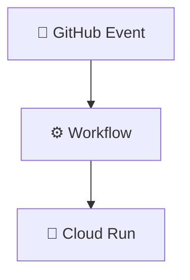
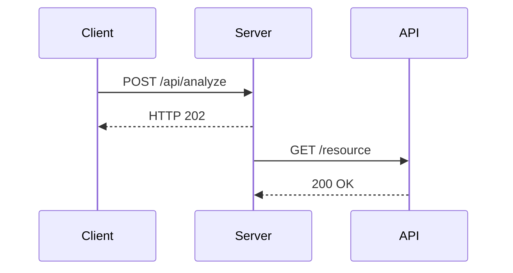
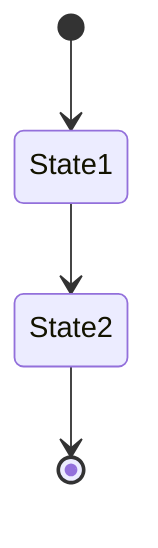
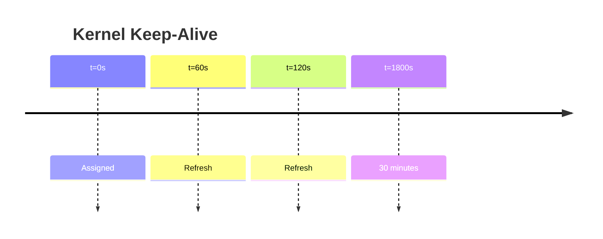
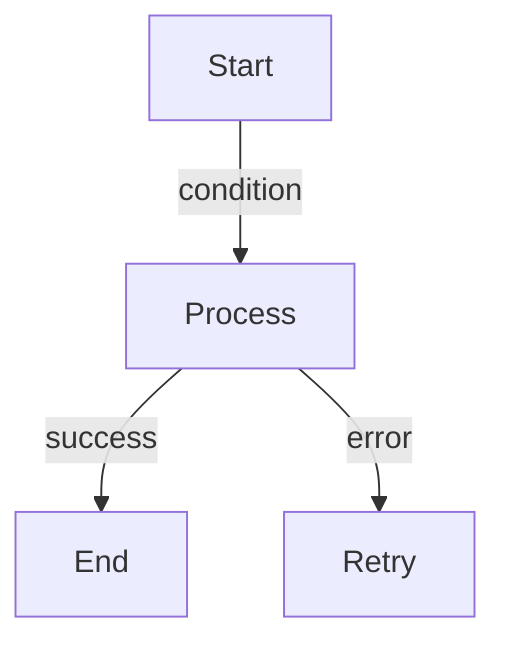
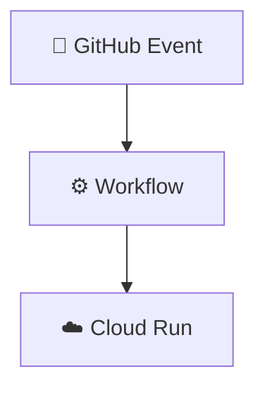

# 📊 Diagrammes - Règle de Standardisation Panini

**STATUS**: ✅ RÈGLE OBLIGATOIRE pour tous les projets  
**Date**: 2025-12-24  
**Auteur**: Copilotage Panini

---

## 🎯 Règle Fondamentale

**Tous les diagrammes doivent utiliser Kroki (via Mermaid, PlantUML, etc.)**

✅ **AUTORISÉ**: Mermaid flowchart, sequenceDiagram, stateDiagram, timeline  
❌ **INTERDIT**: Diagrammes ASCII art (┌─┼┬─┐, │, └─┴┘, ├, ▼, etc.)  
❌ **INTERDIT**: Images PNG/JPG statiques  
❌ **INTERDIT**: Diagrammes en texte brut  

---

## 📝 Syntaxe Markdown (Kroki Support)

### Flowchart (graphiques de flux)
```markdown

```

### Sequence Diagram (interaction temporelle)
```markdown

```

### State Diagram (machine à états)
```markdown

```

### Timeline (chronologie)
```markdown

```

### Graph (diagrammes généralistes)
```markdown

```

---

## ✅ Cas d'Usage

| Diagramme | Format | Exemple |
|-----------|--------|---------|
| **Architecture système** | Mermaid graph | Composants + flux données |
| **Pipeline étapes** | Mermaid flowchart | 5 étapes orchestration |
| **Interactions API** | Mermaid sequenceDiagram | HTTP calls temporalité |
| **Timing de events** | Mermaid timeline | Keep-alive refresh intervals |
| **Transitions états** | Mermaid stateDiagram | OAuth2 token lifecycle |

---

## 🔄 Exemple de Conversion

### ❌ Avant (ASCII - INTERDIT)
```
┌────────────────┐
│   GitHub       │
│   Event        │
└────────┬───────┘
         │
         ▼
┌────────────────┐
│  Workflow      │
└────────┬───────┘
         │
         ▼
┌────────────────┐
│  Cloud Run     │
└────────────────┘
```

### ✅ Après (Mermaid - AUTORISÉ)


---

## 💡 Avantages de Kroki

| Aspect | ASCII | Kroki |
|--------|-------|-------|
| **Versionnable** | ❌ Difficile à merger | ✅ Texte pur, git diff facile |
| **Maintenable** | ❌ Format fragile | ✅ Syntaxe robuste |
| **Modifiable** | ❌ Refaire entièrement | ✅ Édition progressive |
| **Rendu** | ❌ Manual | ✅ Auto sur GitHub/docs |
| **Cohérence** | ❌ Style aléatoire | ✅ Style unifié |
| **Accessibilité** | ❌ Pas de sémantique | ✅ Structure sémantique |

---

## 📋 Checklist de Validation

Avant de valider un PR avec diagrammes:

- [ ] Aucun diagramme ASCII (┌─┬─┐ interdit)
- [ ] Tout utilise Mermaid/PlantUML
- [ ] Diagrammes rendu correctement sur GitHub
- [ ] Syntaxe Markdown respectée (```mermaid)
- [ ] Commentaires explicatifs présents
- [ ] Pas d'images statiques (PNG/JPG)
- [ ] Légende ou annotations présentes

---

## 🔧 Outils Recommandés

| Outil | Usage |
|-------|-------|
| **Mermaid Live** | https://mermaid.live - Éditeur visuel en ligne |
| **VSCode Extension** | "Markdown Preview Mermaid Support" |
| **GitHub** | Rendu natif des diagrammes Mermaid |
| **Kroki Server** | https://kroki.io - Conversion formats multiples |

---

## 📚 Références

- **Mermaid Docs**: https://mermaid.js.org/
- **Kroki Documentation**: https://docs.kroki.io/
- **GitHub Native Support**: Rendu direct .md files

---

## 🚨 Violations Connues

Fichiers à rectifier si conversion effectuée:

- [x] PHASE2_ARCHITECTURE.md (8 diagrammes ASCII → Kroki)
- [x] PHASE2_INTEGRATION_GUIDE.md (2 diagrammes ASCII → Kroki)
- [x] PHASE2_COMPLETION_REPORT.md (1 diagramme ASCII → Kroki)
- [x] PHASE2_FINAL_MANIFEST.md (1 diagramme ASCII → Kroki)

---

**Dernière mise à jour**: 2025-12-24  
**Maintenu par**: Copilotage Panini  
**Appliqué à**: Tous les projets Panini
